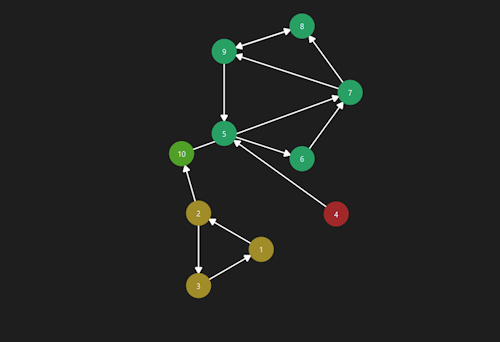
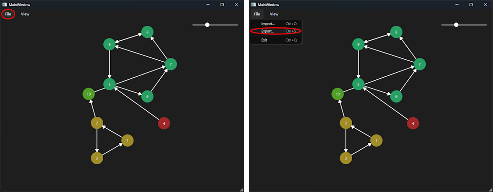

# TP Routing Algorithms

The goal of this project was to implement different graph algorithms, with graphs represented as adjacency matrices. The project should be done in C++, and must include :
- A way to import an adjacency matrix from a `.txt` file ;
- An algorithm to find the shortest path between all pairs of nodes in a graph ;
- An algorithm to find the minimum spanning tree of a graph ;
- An algorithm to find the strongly connected components of a directed graph ;
- An algorithm to create the SCC graph from the original graph ;

My choice was to make this as a Qt application. Aside from the required functionalities, it also includes:
- A way to visualize graphs and matrices ;
- A way to export graphs as images.
- A GUI to interact with the application.

## Summary of the project

### Implemented algorithms

Before diving into how to use the application, here is an overview of the implemented algorithms.

Each algorithm can be found in the `src/matrice.h` and `src/matrice.cpp` files.

#### <u>Floyd-Warshall algorithm (All-Pairs Shortest Paths)</u>

This algorithm finds the shortest paths between all pairs of nodes in a graph, allowing to easily retrieve the shortest path between any two nodes.

The general idea of the algorithm is:
1. Create a distance matrix initialized to the weights of the edges, or `infinity` if there is no edge ;
2. For each node `k`, do:
    - For each pair of nodes `(i, j)`:
        - If `i == k` or `j == k`, skip to the next pair ;
        - Else update the shortest path from `i` to `j` if the path through `k` is shorter\*.

> \* The idea behind this algorithm is that going from `i` to `j` directly is longer than doing `i >> k >> j`.

> If the graph contains negative weight cycles, the behavior is undefined, as the algorithm does not handle them.

It's important to note that the length between `i` to `j` can pass through multiple nodes. For example, the value at `(i; j)` can be the one for the path `i >> k >> j`, meaning that, for subsequent iterations, if the shortest path requires to go from `i` to `j`, it will also pass through `k`, even if not explicitly stated in the matrix.

#### <u>Prim's algorithm (Minimum Spanning Tree)</u>

This algorithm finds the minimum spanning tree (MST), or, in other terms, the subset of edges that connects all vertices in the graph with the minimum possible total edge weight.

The general idea of the algorithm is:
1. Starting with the first node, do `n-1`\* times:
    - Find the edge with the smallest weight that connects a node in the MST to a node outside the MST ;
    - Add this node to the MST and define its parent based on the edge ;
    - Update the other nodes' distances to the MST if needed.
2. Create the MST matrix based on the parent array.

> \* `n-1` because a spanning tree with `n` nodes will have `n-1` edges.

The idea behind this algorithm is:
- Always expand the MST with the smallest possible edge, to only add the minimum number of edges and with the smallest weights ;
- When adding a new node, update the distances and parents of the other nodes of the MST (if they're connected to the new node), to ensure the minimum spanning tree property is maintained.

#### <u>Kosaraju's algorithm (Strongly Connected Components)</u>

This algorithm finds the strongly connected components (SCC) of a directed graph, which are maximal subgraphs where every vertex is reachable from every other vertex in the subgraph.

The general idea of the algorithm is:
1. Perform a depth-first search (DFS) on the original graph, keeping track of the order in which nodes finish (post-order) ;
2. Reverse the direction of all edges in the graph ;
3. Perform a DFS on the reversed graph, using the highest post-order to determine the order of exploration. Each time the DFS finishes, it identifies a strongly connected component.

The way this algorithm works is by, first, searching nodes that connect to as many nodes as possible (and giving them a high post-order value), and then, in the reversed graph, starting from these nodes, which will now be connected to as little nodes as possible, giving strongly connected components.

#### <u>SCC graph creation</u>

This algorithm was hand-crafted to create the SCC graph from the original graph and its SCCs. However, it's highly likely that a similar and possibly more optimized algorithm already exists.

The general idea of the algorithm is:
1. Retrieve the SCCs of the original graph with Kosaraju's algorithm ;
2. Create a new graph where each SCC is represented as a single node ;
3. For each pair `(i, j)` (with `i != j`) in the new graph:
    - For each node `u` in the SCC represented by `i`:
        - For each node `v` in the SCC represented by `j`:
            - If there is an edge from `u` to `v` in the original graph, add an edge from `i` to `j` in the new graph.

> This algorithm includes 4 nested loops, but still has a complexity of `O(n^2)`, as the innermost loops will, in total, only iterate over the edges of the original graph.

---

### Importing a graph

To import a graph, go to `File > Import...` (or use the `Ctrl + O` shortcut) and select a `.txt`.


Graphs are imported from a `.txt` file, with the following format:
```
<number_of_nodes>
<edge 0 => 1> <edge 0 => 2> ... <edge 0 => n>
<edge 1 => 0> <edge 1 => 2> ... <edge 1 => n>
...
<edge n => 0> <edge n => 1> ... <edge n => n>
```

Example: 
```
4
0 1 1 1
1 0 0 0
1 0 1 0
0 1 0 0
```

> The imported graph's size can be up to `UINT32_MAX` (about 4 billion nodes), with values ranging from `INT32_MIN` to `INT32_MAX` (about -2 billion to +2 billion). However, if using exactly the maximum number of nodes or the maximum size, the behavior is undefined, as these values were used for specific cases (ex. `undefined` or `infinity`).

After importing a graph, you won't see any graph or matrix yet. For this, you need to select a view.

---

### Available views (Menu > View)

There is a total of 7 views available under the `View` menu:
- Base Graph: the graph as defined by the matrix ;
- Prim Graph: minimum spanning tree (interprets the matrix as undirected and ignores zeros) ;
- Cluster Graph: graph colored by SCC (Kosaraju) ;
- Base Matrix: matrix as is ;
- Prim Matrix: matrix of the MST returned by Prim ;
- Floyd–Warshall: matrix of shortest paths (sum of weights) ; absence of path marked by red background and « - » ;
- Cluster Matrix: matrix of adjacency between clusters (SCC).


These views can also be accessed through some shortcuts:
|          |  Base  |  Prim  |Floyd-Warshall|Kosaraju|
|----------|--------|--------|--------------|--------|
|**Graph** |`Ctrl+&`|`Ctrl+É`|              |`Ctrl+'`|
|**Matrix**|`Maj+&` |`Maj+É` |   `Maj+"`    |`Maj+'` |

> `Ctrl` for graph views, `Shift` for matrix views.<br />
> `&` or `1`for base, `É` or `2`for MST, `"` or `3` for clusters, `'` or `4` for cluster matrix.

#### Graph views

Graph views display the graph visually, with named nodes and weighted edges:



Nodes are grouped by strongly connected components (SCC), with each component having a different color.

Nodes can be moved by clicking and dragging them with the left mouse button. It's also possible to move the entire view by clicking and dragging outside of any node.

It's also possible to zoom in and out using the mouse wheel or the slider at the top right of the window.

> For larger graphs, it's mandatory to zoom out or to move the graph, as some nodes will be outside of the view initially.

#### Matrix views

Matrix views display the adjacency matrix of the graph, with rows and columns named after the nodes:


Columns and rows headers contain the name of the nodes (or it's index if unnamed).

The cells contain the weights of the edges, or `-` if there is no edge (weight of `0` or `infinity`). Also, cells with a weight of `0` (or `infinity`) are highlighted in red, to easily identify the absence of edges, while those with values are green.

> As for graph views, for larger graphs, it's mandatory to use the scrollbars to see the entire matrix, even if the '*large*' treshold is higher than for graph views.

---

### Exporting a graph

It's possible to export the currently displayed graph or matrix as an image. To do so, go to `File > Export...` (or use the `Ctrl + E` shortcut) and choose a name for the file.



---

### Additional features

#### Example files

The `examples/` folder contains some example `.txt` files that can be used to test the application.

The included sizes are `3`, `4`, `6`, `8`, `10`, `12`, `15`, `20`, `30` and `50` nodes. Each of these sizes is contained in its own folder, named `size_<number_of_nodes>`.

Each size includes an unweighted graph (edges with weight `1` or `0`) (`matrice.txt`), a weighted graph (same graph, but with edges having random weights between `1` and `10`) (`with_weights.txt`), and a complete undirected graph (all nodes connected to each other, with random positive weights) (`install_costs.txt`).

#### Generating random graphs

Examples graphs were, for most of them, generated using three python scripts, located in `examples/<script_name>.py`:
- `create_matrice.py`: generates a random unweighted graph. For a better graph, there is two steps: first, it creates a decent random number of edges between nodes in subgraphs, and then add a few other edges between any nodes, to connect some subgraphs between them ;
- `create_with_weights.py`: takes an unweighted graph as input, and generates a weighted graph by replacing edges with random weights between `1` and `10` ;
- `create_install_costs.py`: generates a complete undirected graph with random positive weights between `1` and `n`.

## Questions

### 1. Which algorithm should be used to find the shortest path between all pairs of nodes in a graph?

To find the shortest path between all pairs of nodes in a graph, the *Floyd-Warshall* algorithm is the best choice. This algorithm can, with a complexity of `O(n^3)`, find the shortest paths between all pairs of nodes in a graph. As a bonus, it also works with graphs that have negative weights (as long as there are no negative cycles, in which case the result will be incorrect, but the algorithm will not crash).

> Compared to this one, *Dijkstra*'s is more suited for finding the shortest path from a single source node to all other nodes in a graph with non-negative weights, while *Bellman-Ford* is also used for single-source shortest paths but can handle graphs with negative weights, at the cost of increased complexity.

### 2. Which algorithm should be used to find the minimum spanning tree of a graph (in the case of a complete graph)?

For finding the minimum spanning tree (MST) of a complete graph, *Prim*'s algorithm is the best choice. It's the most efficient for dense graphs (which complete graphs are the best example), with a time complexity of `O(n^2)`.

> *Kruskal*'s algorithm was another option, but is generally more efficient for sparse graphs, but less so for dense graphs, and even less so for complete graphs.

### 3. Which algorithm should be used to find the strongly connected components of a directed graph?

To find the strongly connected components (SCCs) of a directed graph, *Kosaraju*'s algorithm is a good choice, with a complexity of `O(n^2)`.

> *Tarjan*'s algorithm is another option, with a similar complexity, even if a bit faster in practice, but is more complex to implement.

### Notes

- For these responses, time complexity was computed with the idea that a complexity of `O(e)` (with `e` the number of edges) is equivalent to `O(n^2)` in a complete graph, since `e = (n-1)^2` in this case.